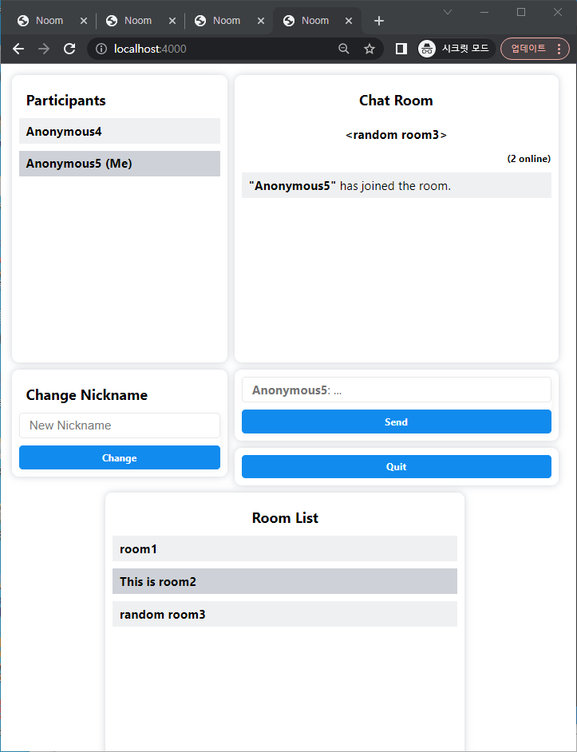

# Zoom Clone

- **One of my personal digital nomad life projects (for practice).**
- **Project current status: [complete]**:ballot_box_with_check:
- **[Assignment01](#assignment01)**
- **[Assignment02](#assignment02)**
- **[Assignment03](#assignment03)**

## Assignment01

- **Current status: [complete]**:ballot_box_with_check:
- **Tech**

  

    &emsp;
    
    
    
  

  

    &emsp;
    
  

- **Demo: [Assignment01 (WebSocket)](https://codesandbox.io/p/sandbox/nomad-noom-challenge-assignment01-3rys5i)**
- **Preview Screenshots**

  

    &emsp;
    
  
  
  &emsp;
  

    &emsp;
    
  

  &emsp;
  

    &emsp;
    
  

 

## Assignment02

- **Current status: [complete]**:ballot_box_with_check:
- **Tech**

  

    &emsp;
    
    
    
  

  

    &emsp;
    
  

- **Demo: [Assignment02 (Socket.io)](https://codesandbox.io/p/sandbox/nomad-noom-challenge-assignment02-fbgev4)**
- **Preview Screenshots**

  

    &emsp;
    
  
  
  &emsp;
  

    &emsp;
    
  

  &emsp;
  

    &emsp;
    
  

  &emsp;
  

    &emsp;
    
  

  &emsp;
  

    &emsp;
    
  

 

## Assignment03

- **Current status: [complete]**:ballot_box_with_check:
- **Tech**

  

    &emsp;
    
    
    
  

  

    &emsp;
    
    
  

- **Demo: [Assignment03 (Socket.io & WebRTC)](https://codesandbox.io/p/sandbox/nomad-noom-challenge-assignment03-z6x1e4)**
- **Supports changing nickname anytime.**
- **Supports both group chats and 1 on 1 video chats.**
- **Supports public room lobby.**
- **Preview Screenshots**

  

    &emsp;
    
  
  
  &emsp;
  

    &emsp;
    
  

  &emsp;
  

    &emsp;
    
  

  &emsp;
  

    &emsp;
    
  

  &emsp;
  

    &emsp;
    
  

  &emsp;
  

    &emsp;
    
  

  &emsp;
  

    &emsp;
    
  

 
